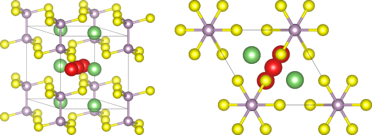
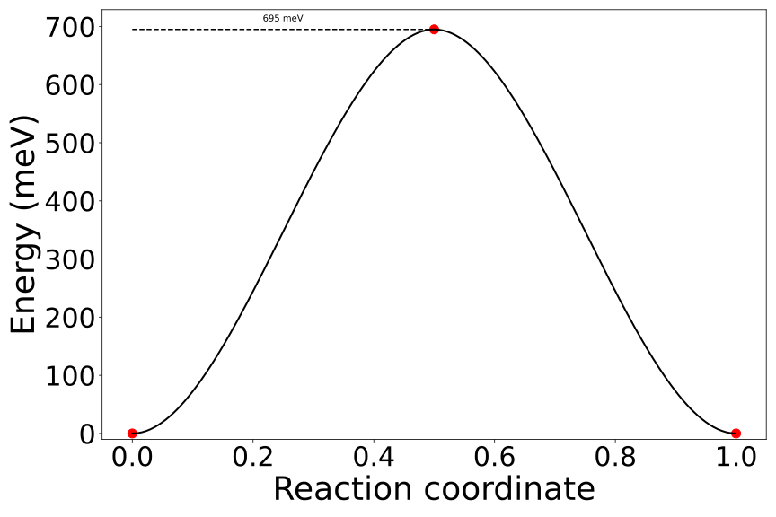

.. _tutorials-calculations-interstitial-li-neb:

NEB Calculation for the Interstitial Migration of Li\ :sup:`+` in Li\ :sub:`4`\ P\ :sub:`2`\ S\ :sub:`6`
========================================================================================================

Topics covered in this tutorial:

* Setting up and running a (error corrected) VASP NEB calculation
* Access generated outputs to plot the NEB path

.. note::

   In this tutorial the VASP code with the additional `VTST`_ tools package is used

Introduction
------------

In this tutorial the :class:`~aiida_cusp.calculators.VaspCalculation` calculator of this plugin is used to run an error corrected, complex NEB calculation using the AiiDA framework.
In the following example the NEB calculation dealing with migration of interstitial Li\ :sup:`+` ions in Li\ :sub:`4`\ P\ :sub:`2`\ S\ :sub:`6` is shown.
Here, three different steps are required:

* First the initial, defect free Li\ :sub:`4`\ P\ :sub:`2`\ S\ :sub:`6` structure is relaxed allowing a full cell relaxation
* In a second step the structures defining the NEB path endpoints are relaxed
* Finally, the NEB calculation is carried out based on the relaxed endpoint structures

.. note::

   This tutorial assumes that you have already a basic knowledge about how to setup a calculation using the :class:`~aiida_cusp.calculators.VaspCalculation` class and what kind of inputs are expected.
   If not, checkout the :ref:`previous tutorial<tutorials-calculations-si-diamond-structure>` dealing the relaxation of a simple Si diamond structure which contains more details about the expected inputs and how to setup a calculation.

Relaxing the initial Structure
------------------------------

In order to calculate the migration energy of a Li\ :sup:`+` ion in the Li\ :sub:`4`\ P\ :sub:`2`\ S\ :sub:`6` crystal structure using NEB we first need to calculated the ground state structure of the defect free Li\ :sub:`4`\ P\ :sub:`2`\ S\ :sub:`6` structure.
We can easily setup the initial structure using pymatgen:

.. code-block:: python

   from pymatgen import Structure, Lattice
   # lattice vector lengths
   a = 6.10622  # a = b
   c = 6.61513
   lattice = Lattice.hexagonal(a=a, c=c)
   # Structure setup with P-31m spacegroup
   positions, species = list(zip(*[
       ([0.3333, 0.6667, 0.0000], "Li"),  # Li1
       ([0.6667, 0.3333, 0.5000], "Li"),  # Li2
       ([0.0000, 0.0000, 0.1715], "P"),
       ([0.3237, 0.0000, 0.2500], "S"),
   ]))
   spacegroup = 162  # P-31m (planar Li4P2S6 structure)
   li4p2s6_structure = Structure.from_spacegroup(spacegroup, lattice, species,
                                                 positions, tol=1.0E-3)

Calculating the ground state structure the ionic positions as well as the cell is allowed to relax (`ISIF=3`).
However, in the following a loose convergence criterion for the remaining ionic forces of `0.1 eV / atom` is applied to speed up the calculations.
In particular, the following `INCAR` parameters are used as calculation inputs:

.. code-block:: python

   incar_params = {
       'ALGO': 'Fast',
       'IBRION': 1,
       'ISIF': 3,
       'EDIFF': 1.0e-6,
       'EDIFFG': -0.1,
       'ENCUT': 420.0,
       'POTIM': 0.55,
       'SIGMA': 0.1,
       # override VASP's NSW=0 default which would abort after the first ionic step
       'NSW': 99,
   }

For the required k-points a gamma centered grid is employed:

.. code-block:: python

   kpoint_params = {
      'mode': 'gamma',
      'kpoints': [3, 3, 2],
   }

With all `INCAR`, `KPOINTS` and structure (i.e. `POSCAR`) inputs being defined we can now initalize the required inputs for the calculation.
Here, AiiDA's :func:`~aiida.plugins.DataFactory` function is used to load the corresponding datatypes provided by the plugin using their defined entry points:

.. code-block:: python

   from aiida.plugins import DataFactory

   # import the required input datatypes
   VaspIncarData = DataFactory('cusp.incar')
   VaspKpointData = DataFactory('cusp.kpoints')
   VaspPoscarData = DataFactory('cusp.poscar')
   VaspPotcarData = DataFactory('cusp.potcar')

   # setup calculation inputs
   incar = VaspIncarData(incar=incar_params)
   kpoints = VaspKpointData(kpoints=kpoint_params)
   poscar = VaspPoscarData(structure=li4p2s6_structure)
   potcar = VaspPotcarData.from_structure(poscar, 'pbe')

Finally, the relaxation of the created Li\ :sub:`4`\ P\ :sub:`2`\ S\ :sub:`6` structure can be started by loading the calculation plugin and connecting the defined inputs to the calculation object,

.. code-block:: python

   from aiida.orm import Code
   from aiida.plugins import CalculationFactory
   from aiida.engine import submit

   # load the VASP and Custodian codes
   vasp_code = Code.get_from_string("vasp_5.4.1_openmpi_4.0.3_scalapack_2.1.0_vtst@CompMPI")
   custodian_code = Code.get_from_string("custodian_2020427@CompMPI")

   # Setup and run the relaxation
   VaspRelax = CalculationFactory('cusp.vasp').get_builder()
   resources = {'tot_num_mpiprocs': 4, 'num_machines': 1}
   VaspRelax.metadata.options.resources = resources
   VaspRelax.code = vasp_code
   VaspRelax.custodian.code = custodian_code
   VaspRelax.custodian.handlers = ["VaspErrorHandler"]
   VaspRelax.incar = incar
   VaspRelax.poscar = poscar
   VaspRelax.kpoints = kpoints
   VaspRelax.potcar = potcar
   # submit the calculation
   node = submit(VaspRelax)

To check if the calculation was submitted to the daemon, simply run ``verdi process list`` and check that the submitted calculation is listed as process in the running state:

.. code-block:: console

   $ verdi process list
     PK  Created    Process label         Process State    Process status
   ----  ---------  --------------------  ---------------  ---------------------------------------
   1692  6s ago     VaspCalculation       ⏵ Waiting        Monitoring scheduler: job state RUNNING

.. note::

   In the example output shown above you can see that the process was submitted and is currently running as process with associated `PK=1692`.
   Remember the shown process ID associated with the calculation since it is needed for the next step.

Relaxing the NEB Path Endpoints
-------------------------------

In the previous step the ground state structure of Li\ :sub:`4`\ P\ :sub:`2`\ S\ :sub:`6` was calculated featuring a full cell relaxation.
Using the relaxed structure of this calculation we can now setup the endpoints defining the NEB path of interest.
In this example the added, interstitial Li\ :sup:`+` is assumed to migrate in between two neighboring Li lattice sites.
Thus, the positions defining the start and the end of the migration path are given by

.. code-block:: python

   positions = [
      [0.3333, 0.3333, 0.4500],  # initial Li+ position (start of NEB path)
      [0.6667, 0.6667, 0.5500],  # final Li+ position (end of NEB path)
  ]

Since the migration of an interstitial Li ion is calculated, the Li ion has to be included as additional atom.
Using the relaxed structure of the previous calculation two new structures are generated giving the complete structure with the additional Li ion before and after the migration took place:

.. code-block:: python

   from aiida.orm import load_node
   # load the relaxed Li4P2S6 structure without additional Li-ion
   relaxed_structure = load_node(1692).outputs.parsed_results.contcar.get_structure()
   # create two new structures with an additional Li-ion sitting at the
   # initial NEB-path and final NEB-path position
   endpoints = []
   for position in positions:
      structure = relaxed_structure.copy()
      structure.append("Li", position)
      endpoints.append(structure)

In order to relax the created structure containing the additional Li-ions we use the same `INCAR`, `KPOINTS` and `POTCAR` parameters used for the relaxation of the initial, defect free unit cell.
However, now no cell relaxation is allowed and only ionic positions are considered as variable degree of freedom.
In addition, a constant background charge is added to the calculation to account for the `+1` charge of the added Li-ion, thus:

.. code-block:: python

   incar_params.update({'ISIF': 2})
   incar_params.update({'NELECT': 50})
   incar = VaspIncarData(incar=incar_params)

With the updated incar we can again submit the relaxation of both endpoint structures to the daemon, equivalent to the procedure shown for the unit cell structure before.

.. code-block:: python

   # shared settings
   VaspRelaxEndpoint = CalculationFactory('cusp.vasp').get_builder()
   resources = {'tot_num_mpiprocs': 4, 'num_machines': 1}
   VaspRelaxEndpoint.metadata.options.resources = resources
   VaspRelaxEndpoint.code = vasp_code
   VaspRelaxEndpoint.custodian.code = custodian_code
   VaspRelaxEndpoint.custodian.handlers = ["VaspErrorHandler"]
   VaspRelaxEndpoint.incar = incar
   VaspRelaxEndpoint.kpoints = kpoints
   # individual settings per endpoint, i.e. the structure
   for endpoint in endpoints:
       VaspRelaxEndpoint.poscar = VaspPoscarData(structure=endpoint)
       VaspRelaxEndpoint.potcar = VaspPotcarData.from_structure(endpoint, 'pbe')
       node = submit(VaspRelaxEndpoint)

Again, using the ``verdi process list`` command to show the active processes should now output two calculations corresponding to the submitted relaxations for the two endpoints.

.. code-block:: console

   $ verdi process list
     PK  Created    Process label         Process State    Process status
   ----  ---------  --------------------  ---------------  ---------------------------------------
   1722  15s ago    VaspCalculation       ⏵ Waiting        Monitoring scheduler: job state RUNNING
   1727  15s ago    VaspCalculation       ⏵ Waiting        Monitoring scheduler: job state RUNNING

.. note::

   The relaxed enpoint structures generated by those calculations are used to interpolate the NEB path fed into the final NEB calculation.
   So, once again, remember the process IDs displayed in this output, i.e. `1722` and `1727`.

Running the NEB Calculation
---------------------------

To setup the final NEB calculation we first need to find intermediate images by interpolating the path between the defined NEB path endpoints.
In the following this interpolation step is shown based on the interpolation method naturally implemented in the :class:`~pymatgen.Structure` class.
Using the relaxed endpoints of the previous step a NEB path containing a single intermediate image is generated running the following code.

.. code-block:: python

   # get the start and final node of the NEB path (previoulsy relaxed)
   struct_start = load_node(1722).outputs.parsed_results.contcar.get_structure()
   struct_final = load_node(1727).outputs.parsed_results.contcar.get_structure()
   # interpolate NEB path between struct_start and struct_final featuring a
   # single intermediate image
   neb_path_struct = struct_start.interpolate(struct_final, nimages=2)
   # transform list of pymatgen structures to list of Poscar input
   # structures
   neb_path_poscar = [VaspPoscarData(structure=s) for s in neb_path_struct]

The list ``neb_path_poscar`` now contains three :class:`aiida_cusp.data.VaspPoscarData` structures defining the NEB path of the interstitially migrating Li-ion as shown in the following image:

In order to combine the single structures to a connected NEB path in the calculation we need to tell VASP that it has to run a NEB calculation.
To this end additional NEB parameters have to be added to the `INCAR` parameters of the previous endpoint relaxation:

.. code-block:: python

   incar_params.update({'IMAGES': 1})  # a single intermediate image
   incar_params.update({'LCLIMB': True})  # use the climbing image algorithm
   incar_params.update({'SPRING': -5.0})  # spring force of the nudged elastic band
   incar = VaspIncarData(incar=incar_params)

Setting up the NEB calculation using the :class:`~aiida_cusp.calculators.VaspCalculation` is straightforward and does not differ from the setup of a regular calculation except for one point.
Instead of a single structure passed to the calculation via the `inputs.poscar` option, NEB calculations expect a dictionary of node labels and corresponding structures defining the NEB path passed to the calculation via the `inputs.neb_path` option. For the defined NEB path in this example the path is passed to the calculation as follows.

.. code-block:: python

   VaspNeb = CalculationFactory('cusp.vasp').get_builder()
   VaspNeb.neb_path = {
      'node_00': neb_path_poscar[0],  # endpoint1: the intial position
      'node_01': neb_path_poscar[1],  # intermediate: the interpolated intermediate image
      'node_02': neb_path_poscar[2],  # endpoint2: the final position
   }

All other expected parameters are defined in the same way as for regular VASP calculations, i.e.

.. code-block:: python

   resources = {'tot_num_mpiprocs': 4, 'num_machines': 1}
   VaspNeb.metadata.options.resources = resources
   VaspNeb.code = vasp_code
   VaspNeb.custodian.code = custodian_code
   VaspNeb.custodian.handlers = ["VaspErrorHandler"]
   VaspNeb.incar = incar
   VaspNeb.kpoints = kpoints
   VaspNeb.potcar = potcar
   # after setup: submit the calculation
   node = submit(VaspNeb)

which sets up the remaining inputs and submits the NEB calculation to the daemon:

.. code-block:: console

   $ verdi process list
     PK  Created    Process label         Process State    Process status
   ----  ---------  --------------------  ---------------  ---------------------------------------
   1747  5s ago     VaspCalculation       ⏵ Waiting        Monitoring scheduler: job state RUNNING

Plotting the Calculated NEB Path
--------------------------------

Usually the NEB calculations are analyzed based on the generated OUTCAR files.
However, only a single OUTCAR file is generated by the NEB calculation started here, i.e. for the intermediate image, while the start and final structure are held fixed.
Thus, to analyze the NEB calculation the NEB calculation outputs for the intermediate image as well as the outputs of the relaxation runs for the endpoints (containing the missing OUTCAR files of the fixed endpoints) are required.
Since all calculations were done using the AiiDA framework and each calculation is identified by an associated id this is not a very complicated task and both, relaxed structures as well as the outcar files can be retrieved very easily:

.. code-block:: python

   from aiida.orm import load_node
   # OUTCARs for the initial, intermediate and final NEB position
   # Here the initial and final OUTCARs are taken from the endpoint
   # relaxations while the intermediate OUTCAR is taken from the performed
   # NEB calculation!
   outcars = [
       load_node(1722).outputs.parsed_results.outcar.get_outcar(),
       load_node(1747).outputs.parsed_results.node_01.outcar.get_outcar(),
       load_node(1727).outputs.parsed_results.outcar.get_outcar(),
   ]

   # CONTCARs for the initial, intermediate and final NEB position
   # Here the initial and final CONTCARs are taken from the endpoint
   # relaxations while the intermediate CONTCAR is taken from the performed
   # NEB calculation!
   structures = [
       load_node(1722).outputs.parsed_results.contcar.get_structure(),
       load_node(1747).outputs.parsed_results.node_01.contcar.get_structure(),
       load_node(1727).outputs.parsed_results.contcar.get_structure(),
   ]

With all `OUTCAR` and `CONTCAR` outputs being loaded for all NEB path nodes we can now simply analyze and plot the minimum energy path associated with the chosen NEB migration path.
Using the :class:`~pymatgen.analysis.transition_state.NEBAnalysis` module:

.. code-block:: python

   from pymatgen.analysis.transition_state import NEBAnalysis

   neb_path_analyzer = NEBAnalysis.from_outcars(outcars, contcars)
   neb_path_plot = neb_path_analyzer.get_plot()
   neb_path_plot.show()

which should output the minimum energy path similar to the plot shown below.

Copy-and-Paste
--------------

.. note::

   In the following copy-and-pasteable code snippets are given for the calculation steps discussed in this tutorial.
   These calculation steps contain:

   1. :ref:`Initial relaxation of the structure<tutorials-calculations-interstitial-li-neb-relax-initial>`
   2. :ref:`Setup and relaxation of the NEB path endpoints<tutorials-calculations-interstitial-li-neb-relax-endpoints>`
   3. :ref:`The actual NEB calculation<tutorials-calculations-interstitial-li-neb-relax-neb-calc>`
   4. :ref:`Final analysis of the generated minimum energy path<tutorials-calculations-interstitial-li-neb-relax-neb-analysis>`

   In order to use the snippes given below, copy the code snippets to four different files and subsequently execute the files in the disussed order using ``verdi run``.
   After each submitted calculation is finished do not forget to update the code-labels and the calculation IDs before running the next calculation!

.. _tutorials-calculations-interstitial-li-neb-relax-initial:

1. Relax Initial Structure
^^^^^^^^^^^^^^^^^^^^^^^^^^

.. code-block:: python

   from pymatgen import Structure, Lattice, PeriodicSite
   from aiida.orm import Code
   from aiida.plugins import CalculationFactory, DataFactory
   from aiida.engine import submit

   # the VASP and Custodian codes to be used for the calculation
   vasp_code_label = "your_vasp_vtst_code_label"
   custodian_code_label = "your_custodian_code_label"

   # define all input datatypes
   VaspIncarData = DataFactory('cusp.incar')
   VaspKpointData = DataFactory('cusp.kpoints')
   VaspPoscarData = DataFactory('cusp.poscar')
   VaspPotcarData = DataFactory('cusp.potcar')

   #
   # Setup the Li4P2S6 structure
   #
   # lattice vector lengths
   a = 6.10622  # a = b
   c = 6.61513
   lattice = Lattice.hexagonal(a=a, c=c)
   # Structure setup with P-31m spacegroup
   positions, species = list(zip(*[
       ([0.3333, 0.6667, 0.0000], "Li"),  # Li1
       ([0.6667, 0.3333, 0.5000], "Li"),  # Li2
       ([0.0000, 0.0000, 0.1715], "P"),
       ([0.3237, 0.0000, 0.2500], "S"),
   ]))
   spacegroup = 162  # P-31m (planar Li4P2S6 structure)
   structure = Structure.from_spacegroup(spacegroup, lattice, species, positions,
                                         tol=1.0E-3)
   # Setup the input parameters
   incar_params = {
       'ALGO': 'Fast',
       'IBRION': 1,
       'ISIF': 3,
       'EDIFF': 1.0e-6,
       'EDIFFG': -1.0e-1,
       'ENCUT': 420.0,
       'POTIM': 0.55,
       'SIGMA': 0.1,
       'NSW': 99,
   }
   incar = VaspIncarData(incar=incar_params)
   poscar = VaspPoscarData(structure=structure)
   kpoints = VaspKpointData(kpoints={'mode': 'gamma', 'kpoints': [3, 3, 2]})
   # Setup the caclulation inputs
   VaspRelax = CalculationFactory('cusp.vasp').get_builder()
   resources = {'tot_num_mpiprocs': 4, 'num_machines': 1}
   VaspRelax.metadata.options.resources = resources
   VaspRelax.code = Code.get_from_string(vasp_code_label)
   VaspRelax.incar = incar
   VaspRelax.poscar = poscar
   VaspRelax.kpoints = kpoints
   VaspRelax.potcar = VaspPotcarData.from_structure(poscar, 'pbe')
   # custodian error correction
   VaspRelax.custodian.code = Code.get_from_string(custodian_code_label)
   VaspRelax.custodian.handlers = ["VaspErrorHandler"]
   # submit the calculation
   node = submit(VaspRelax)
   # print out the PK of the submitted job
   print("Submitted Relaxtion of Li4P2S6 with PK: {}".format(node.pk))

.. _tutorials-calculations-interstitial-li-neb-relax-endpoints:

2. Relax the NEB Path Endpoints
^^^^^^^^^^^^^^^^^^^^^^^^^^^^^^^

.. code-block:: python

   from aiida.orm import Code, load_node
   from aiida.plugins import CalculationFactory, DataFactory
   from aiida.engine import submit

   # Add the node-ID for the previously performed unit cell relaxation
   previous_calc_id =

   # code labels
   vasp_code_label = "your_vasp_vtst_code"
   custodian_code_label = "your_custodian_code"

   # define all input datatypes
   VaspIncarData = DataFactory('cusp.incar')
   VaspKpointData = DataFactory('cusp.kpoints')
   VaspPoscarData = DataFactory('cusp.poscar')
   VaspPotcarData = DataFactory('cusp.potcar')

   # load relaxed structure from calculation
   outputs = load_node(previous_calc_id).outputs
   relaxed_structure = outputs.parsed_results.contcar.get_structure()
   # NEB path positions start / stop
   positions = [
       [0.3333, 0.3333, 0.4500],  # NEB path start position
       [0.6667, 0.6667, 0.5500],  # NEB path end position
   ]
   # the structures with the initial and final interstitial Li position
   endpoints = []
   for position in positions:
       structure = relaxed_structure.copy()
       structure.append("Li", position)
       endpoints.append(structure)
   # Setup the calculation Inpts
   incar_params = {
       'ALGO': 'Fast',
       'IBRION': 1,
       'ISIF': 2,
       'EDIFF': 1.0e-6,
       'EDIFFG': -1.0e-1,
       'ENCUT': 420.0,
       'POTIM': 0.55,
       'SIGMA': 0.1,
       'NELECT': 50,  # Background charge for added Li+ interstitial
       'NSW': 99,
   }
   incar = VaspIncarData(incar=incar_params)
   kpoints = VaspKpointData(kpoints={'mode': 'gamma', 'kpoints': [3, 3, 2]})
   # Setup the calculation
   VaspRelaxEndpoint = CalculationFactory('cusp.vasp').get_builder()
   resources = {'tot_num_mpiprocs': 4, 'num_machines': 1}
   VaspRelaxEndpoint.metadata.options.resources = resources
   VaspRelaxEndpoint.code = Code.get_from_string(vasp_code_label)
   VaspRelaxEndpoint.incar = incar
   VaspRelaxEndpoint.kpoints = kpoints
   # custodian error correction
   VaspRelaxEndpoint.custodian.code = Code.get_from_string(custodian_code_label)
   VaspRelaxEndpoint.custodian.handlers = ["VaspErrorHandler"]
   # Run the NEB path endpoint relaxations in parallel, i.e. submit both
   # calculations at once
   for endpoint in endpoints:
       VaspRelaxEndpoint.poscar = VaspPoscarData(structure=endpoint)
       VaspRelaxEndpoint.potcar = VaspPotcarData.from_structure(endpoint, 'pbe')
       node = submit(VaspRelaxEndpoint)
       ## print out the PK of the submitted job
       print("Submitted VaspSiRelax with PK: {}".format(node.pk))

.. _tutorials-calculations-interstitial-li-neb-relax-neb-calc:

Running the NEB Calculation
^^^^^^^^^^^^^^^^^^^^^^^^^^^

.. code-block:: python

   from aiida.orm import Code
   from aiida.plugins import CalculationFactory, DataFactory
   from aiida.engine import submit

   # Add the node-ID for the previously performed endpoint relaxations for the
   # initial and final endpoint
   initial_endpoint_calc_id =
   final_endpoint_calc_id =

   # code labels
   vasp_code_label = "your_vasp_vtst_code"
   custodian_code_label = "your_custodian_code"

   # define all input datatypes
   VaspIncarData = DataFactory('cusp.incar')
   VaspKpointData = DataFactory('cusp.kpoints')
   VaspPoscarData = DataFactory('cusp.poscar')
   VaspPotcarData = DataFactory('cusp.potcar')

   # get the start and final node of the NEB path (previoulsy relaxed)
   outputs_start = load_node(initial_endpoint_calc_id).outputs
   struct_start = outputs.parsed_results__contcar.get_structure()
   outputs_final = load_node(final_endpoint_calc_id).outputs
   struct_final = outputs.parsed_results__contcar.get_structure()

   # build the neb path using pymatgen featuring a single intermediate image
   neb_path_struct = struct_start.interpolate(struct_final, nimages=2)
   neb_path_poscar = [VaspPoscarData(structure=s) for s in neb_path_struct]

   # Setup the calculation Inpts
   incar_params = {
       'ALGO': 'Fast',
       'IBRION': 1,
       'ISIF': 2,
       'EDIFF': 1.0e-6,
       'EDIFFG': -1.0e-1,
       'ENCUT': 420.0,
       'POTIM': 0.55,
       'SIGMA': 0.1,
       'NELECT': 50,  # Background charge for added Li+ interstitial
       'NSW': 99,
       # NEB parameters
       'IMAGES': 1,  # a single intermediate image
       'LCLIMB': True,
       'SPRING': -5.0,
   }
   neb_incar = VaspIncarData(incar=incar_params)
   neb_path = {
       'node_00': neb_path_poscar[0],
       'node_01': neb_path_poscar[1],
       'node_02': neb_path_poscar[2],
   }
   kpoints = VaspKpointData(kpoints={'mode': 'gamma', 'kpoints': [3, 3, 2]})
   # simply use the first structure to initialize the potcars
   potcar = VaspPotcarData.from_structure(neb_path_poscar[0], 'pbe')
   # Setup the caclulation inputs
   VaspNeb = CalculationFactory('cusp.vasp').get_builder()
   resources = {'tot_num_mpiprocs': 4, 'num_machines': 1}
   VaspNeb.metadata.options.resources = resources
   VaspNeb.code = Code.get_from_string(vasp_code_label)
   VaspNeb.incar = neb_incar
   VaspNeb.neb_path = neb_path
   VaspNeb.kpoints = kpoints
   VaspNeb.potcar = potcar
   # custodian error correction
   VaspNeb.custodian.code = Code.get_from_string(custodian_code_label)
   VaspNeb.custodian.handlers = ["VaspErrorHandler"]
   # submit the NEB calculation
   node = submit(VaspNeb)
   # print out the PK of the submitted job
   print("Submitted VaspSiRelax with PK: {}".format(node.pk))

.. _tutorials-calculations-interstitial-li-neb-relax-neb-analysis:

NEB Path Analysis
^^^^^^^^^^^^^^^^^

.. code-block:: python

   from aiida.orm import load_node
   from pymatgen.analysis.transition_state import NEBAnalysis

   # Node-IDs for the previous endpoint calculations
   endpoint_start_calc_id =
   endpoint_final_calc_id =
   # Node-ID for the actual NEB calculation
   neb_calc_id =
   # initial, intermediate and final NEB node OUTCARs
   outcars = [
       load_node(endpoint_start_calc_id).outputs.parsed_results__outcar.get_outcar(),
       load_node(neb_calc_id).outputs.parsed_results__node_01__outcar.get_outcar(),
       load_node(endpoint_final_calc_id).outputs.parsed_results__outcar.get_outcar(),
   ]
   # initial, intermediate and final NEB node CONTCARs
   structures = [
       load_node(endpoint_start_calc_id).outputs.parsed_results.contcar.get_structure(),
       load_node(neb_calc_id).outputs.parsed_results.node_01.contcar.get_structure(),
       load_node(endpoint_final_calc_id).outputs.parsed_results.contcar.get_structure(),
   ]
   # populate pymatgen NEB analyzer and plot the calculated minimumenergy path
   neb_analyzer = NEBAnalysis.from_outcars(outcars, structures)
   neb_plot = neb_analyzer.get_plot()
   neb_plot.show()

.. _VTST: https://theory.cm.utexas.edu/vtsttools/
